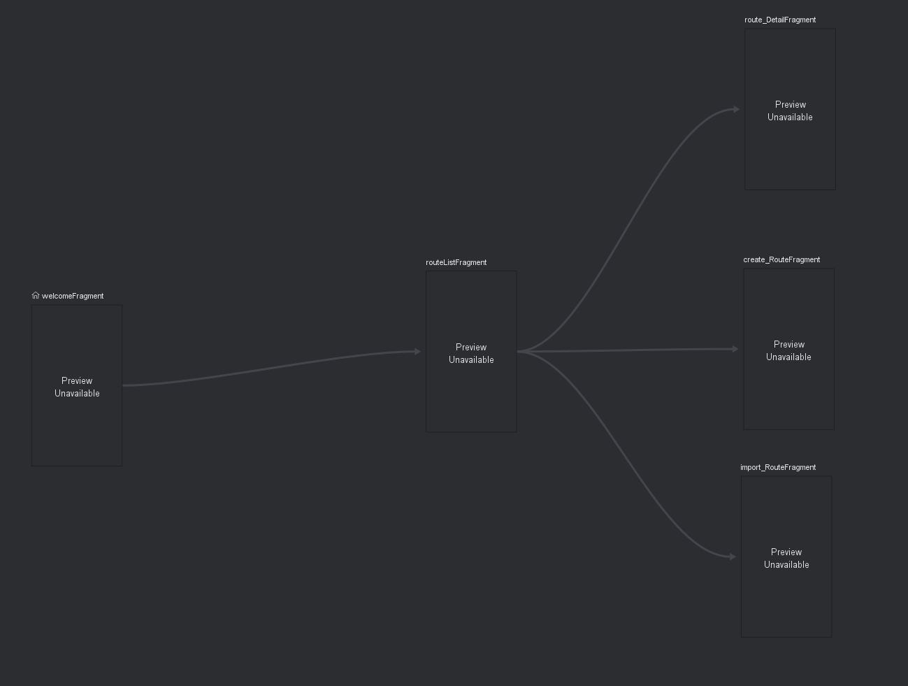

# Diseño 

El diseño de la aplicación se centra en garantizar una experiencia de usuario intuitiva y eficiente, con una navegación clara y funcionalidades clave que permitan a los usuarios interactuar con el sistema de manera óptima. A continuación, se describen las funciones esenciales del diseño y se proporciona una visión general de la navegación.

## Funciones y Características Clave

1. **Pantalla de Inicio:**  
   - Iniciar sesion  
   - Registro de cuenta nueva.  

2. **Visualizacion de Rutas:**  
   - Vista con scroll en donde aparecen todas las rutas realizadas por el usuario con detalles basicos como nombre de ruta y km  
   - Opción para eliminar una determinada ruta en esa misma vista.  

3. **Registro de Rutas:**  
   - Opciones para iniciar registro, pausarlo o guardar ruta
   - Visualizacion de datos en tiempo real

4. **Detalle de Ruta:**  
   - Visualización de datos avanzadaos y mapa interactivo de la ruta.  
   - Opciones para editar rutas.  

6. **Importar ruta:**  
   - Opcion para importar rutas en formato .gpx.

## Navegación 

La navegación de la aplicación será clara, con una barra de navegación principal ubicada en la parte inferior que conecta las secciones clave. A continuación, se adjunta un esquema general de la navegación entre pantallas:

### Esquema de Mockup y Navegación

    

## Notas Adicionales 

El diseño visual estará basado en un enfoque minimalista y moderno, empleando colores claros y elementos gráficos intuitivos. Se utilizarán librerías como Material Design o equivalentes para garantizar consistencia y accesibilidad en todas las plataformas.
